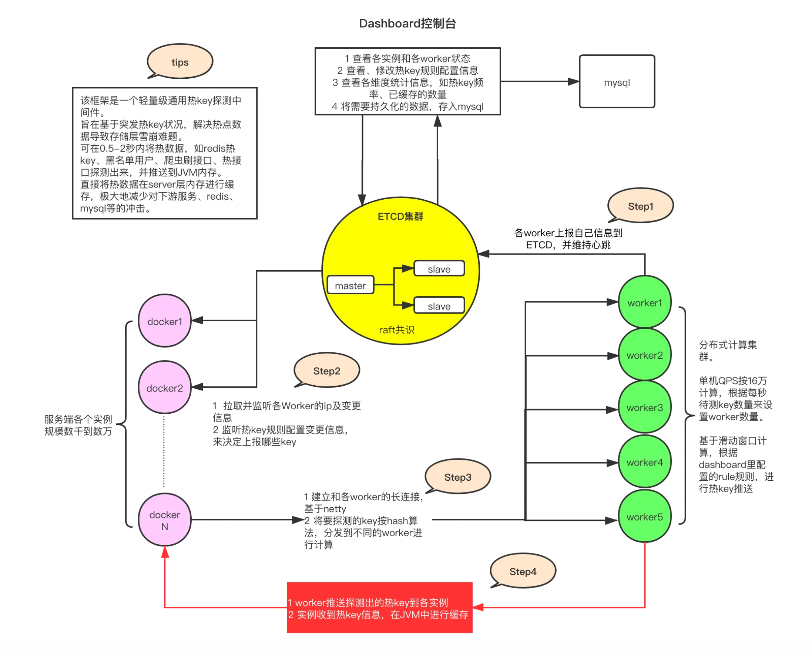

# 面试熊🐻刷题平台 后端工程

>作者: Samoyer

>仅用于交流使用

>上线版本（后续功能更新）：https://github.com/AronAlan/mianshixiong

### 主流框架 & 特性

- Spring Boot 2.7.x
- Spring MVC
- MyBatis + MyBatis Plus 数据访问
- Spring Boot 调试工具和项目处理器
- Spring AOP 切面编程
- Spring Scheduler 定时任务
- Spring 事务注解

### 数据存储

- MySQL 数据库
- Redis 内存数据库
- Elasticsearch 搜索引擎

### 工具类

- Easy Excel 表格处理
- Hutool 工具库
- Apache Commons Lang3 工具类
- Lombok 注解

### 业务特性

- 业务代码生成器
- Spring Session Redis 分布式登录
- 全局请求响应拦截器
- 全局异常处理器
- 自定义错误码
- 封装通用响应类
- Swagger + Knife4j 接口文档
- 自定义权限注解 + 全局校验（已废弃）
- 全局跨域处理
- 长整数丢失精度解决
- 多环境配置
- Sa-token权限校验 + 同端登录互斥
- Nacos配置黑名单IP
- Sentinel限流、熔断、降级
- 基于Redis的分级反爬虫


## 业务功能

- 用户登录、注册、注销、更新、检索、权限管理
- 题目创建、删除、编辑、更新、数据库检索、ES 灵活检索
- 题目收藏、取消收藏、检索已收藏题目（暂未实现）
- 题目全量同步 ES、增量同步 ES 定时任务
- 自动缓存热门题库、题目

### 自动缓存机制
本项目基于热点key探测框架京东`Hotkey`实现自动缓存热门题库和题目

主要实现的功能：
1. 记录访问：用户每访问一次题库，统计次数 +1
2. 访问统计：统计一段时间内题库的访问次数。
3. 阈值判断：访问频率超过一定的阈值，变为热点数据。
4. 缓存数据：缓存热点数据
5. 获取数据：后续访问时，从缓存中获取数据


   

### 单元测试

- JUnit5 单元测试
- 示例单元测试类

### 架构设计

- 合理分层


## 相关配置
### MySQL 数据库

1）修改 `application.yml` 的数据库配置：

```yml
spring:
  datasource:
    driver-class-name: com.mysql.cj.jdbc.Driver
    url: jdbc:mysql://localhost:3306/my_db
    username: root
    password: 123456
```

### Redis 分布式登录

1）修改 `application.yml` 的 Redis 配置：

```yml
spring:
  redis:
    database: 1
    host: localhost
    port: 6379
    timeout: 5000
    password: 123456
```

2）修改 `application.yml` 中的 session 存储方式：

```yml
spring:
  session:
    store-type: redis
```

3）移除 `MainApplication` 类开头 `@SpringBootApplication` 注解内的 exclude 参数：

修改前：

```java
@SpringBootApplication(exclude = {RedisAutoConfiguration.class})
```

修改后：


```java
@SpringBootApplication
```

### Elasticsearch 搜索引擎

修改 `application.yml` 的 Elasticsearch 配置：

```yml
spring:
  elasticsearch:
    uris: http://localhost:9200
    username: root
    password: 123456
```
### Nacos控制台配置黑名单IP
```yaml
blackIpList:
- "1.1.1.1"
- "2.2.2.2"
```

### Hotkey控制台配置热点规则
```json
[
    {
    "duration": 600,
    "key": "bank_detail_",
    "prefix": true,
    "interval": 5,
    "threshold": 10,
    "desc": "热门题库缓存"
    },
    {
    "duration": 600,
    "key": "question_detail_",
    "prefix": true,
    "interval": 5,
    "threshold": 10,
    "desc": "热门题目缓存"
    }
]
```

### Sentinel
cmd:
```java
java -Dserver.port=8131 -jar sentinel-dashboard-1.8.6.jar
```
powershell:
```java
java "-Dserver.port=8131" -jar sentinel-dashboard-1.8.6.jar
```

## 启动所需
分别启动：
1. MySQL
2. Elasticsearch
3. Etcd
4. Nacos
5. Redis
6. [Hotkey](https://gitee.com/jd-platform-opensource/hotkey)
(修改各模块中的端口及信息，执行`dashboard/src/main/resources/sb.sql`,分别启动`work`和`dashboard`)
7. 添加启动类`MainApplication`的JVM参数`-Dcsp.sentinel.dashboard.server=localhost:8131`
